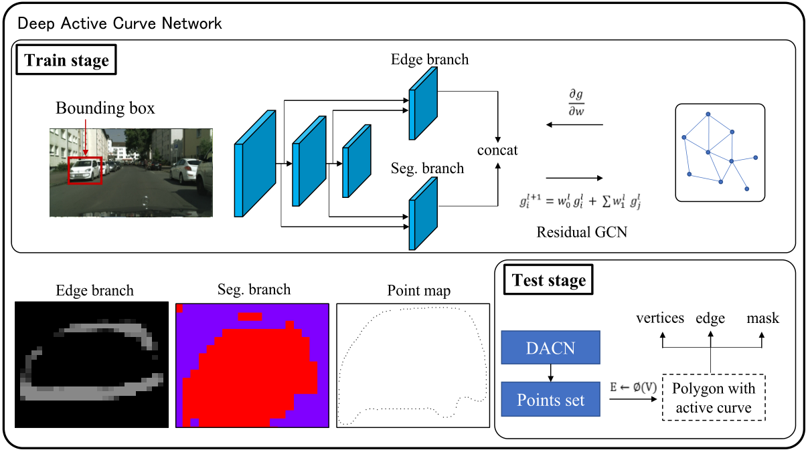
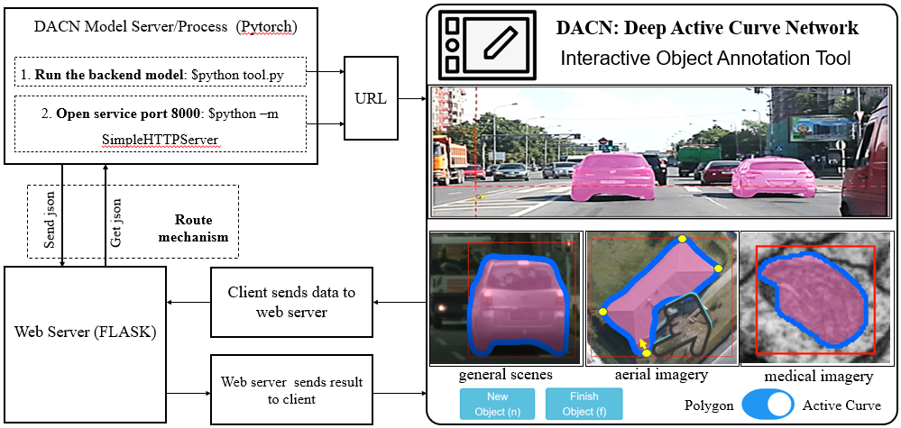

# Deep Active Curve Network for Instance Annotation and Segmentation

This is the PyTorch implementation of DACN. This repository allows you to train new DACN models.   


## The visual implement of Deep Active Curve Network (DACN) for instance annotation



## Interactive instance annotation and segmentation

This system is based on the FLASK framework. Therefore, its structure is shown below:




## Acknowledges

This code is based on Curve-GCN. Thanks to the contributors of Curve-GCN, please cite:

    @inproceedings{CurveGCN2019,
    title={Fast Interactive Object Annotation with Curve-GCN},
    author={Huan Ling and Jun Gao and Amlan Kar and Wenzheng Chen and Sanja Fidler},
    booktitle={CVPR},
    year={2019}
    }


# Environment Setup
All the code has been run and tested on Ubuntu 16.04, Python 2.7.12, Pytorch 0.4.1, CUDA 9.0, TITAN X/Xp and GTX 1080Ti GPUs

- Go into the downloaded code directory
```
cd <path_to_downloaded_directory>
```
- Setup python environment
```
virtualenv env
source env/bin/activate
pip install -r requirements.txt
```
- Add the project to PYTHONPATH
```
export PYTHONPATH=$PWD
```

## Data

### Cityscapes
- Download the Cityscapes dataset (leftImg8bit\_trainvaltest.zip) from the official [website](https://www.cityscapes-dataset.com/downloads/) [11 GB]
- Please [signup](http://www.cs.toronto.edu/annotation/curvegcn/code_signup/) here, you get the processed annotation files are included in the download.
- From the root directory, run the following command with appropriate paths to get the annotation files ready for your machine
```
python Scripts/data/change_paths.py --city_dir <path_to_downloaded_leftImg8bit_folder> --json_dir <path_to_downloaded_annotation_file> --out_dir <output_dir> ---->

python Scripts/data/change_paths.py --city_dir ../data/leftImg8bit --json_dir ../data/cityscapes_final_v5 --out_dir ../result_data
```

## Training

- Download the pre-trained Pytorch Resnet-101 from [here](https://download.pytorch.org/models/resnet101-5d3b4d8f.pth)
- Modify "exp\_dir", "encoder\_reload", "data\_dir" attributes at Experiments/gnn-active-spline.json
- Run script:
```
python Scripts/train/train_gnn_active_spline.py --exp Experiments/gnn-active-spline.json
```

## Prediction
Generate prediction masks:  
```
python Scripts/prediction/generate_annotation_from_active_spline.py --exp <path to exp file> --output_dir <path to output dir> --reload <path to checkpoint> 

python Scripts/prediction/generate_annotation_from_active_spline.py --exp=Experiments/gnn-active-spline.json --output_dir=predict_result/ --reload=./trainmodels/curves/checkpoints/epoch5_step23000.pth
```

Calculate IOU:  
```
python Scripts/get_scores.py --pred <path to output dir> --output  <path to output txt file>

python Scripts/get_scores.py --pred=predict_result/ --output=./eval.txt
```

## Annotation tools based on DACN 

### Backend
- Launch backend (flask server) with,
```
python Tool/tool.py --exp Experiments/tool.json --reload <path_to_model> --port <port> --image_dir Tool/frontend/static/img/

python Tool/tool.py --exp Experiments/tool.json --reload=./trainmodels/curves/checkpoints/epoch5_step23000.pth --image_dir Tool/frontend/static/img/
```

### Frontend
- Edit Tool/frontend/static/js/polygon.js and change globalFolder to the appropriate
directory based on where you cloned the repository.
- With python2.7, run
```
cd Tool/frontend/
python -m SimpleHTTPServer
```
- On your browser, navigate to localhost:8000. 

**Note:** Replace SimpleHTTPServer with http.server if you are using python3 for the server

**Note:** You can setup your own image directory by editing Tool/frontend/static/js/polygon.js and passing that path to Tool/tool.py
from the command line. This image directory MUST contain the pre-defined images that are defined in Tool/frontend/index.html

URL: 0.0.0.0:8000


## Cites

If you are using the code here in a publication, please consider citing our paper:

    @article{dong2019automatic,
      title={Automatic Annotation and Segmentation of Object Instances With Deep Active Curve Network},
      author={Dong, Zihao et. al},
      journal={IEEE Access},
      volume={7},
      pages={147501--147512},
      year={2019}
    }
